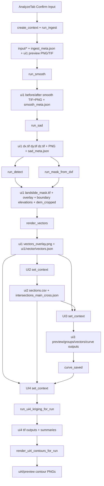

# Current Dataflow

## Runtime Entry

1. `main.py` or `pedi_oku_landslide/__main__.py`
2. `pedi_oku_landslide/app/bootstrap.py`
3. `pedi_oku_landslide/ui/main_window.py`
4. `pedi_oku_landslide/app/workflow.py`

`MainWorkflowCoordinator` wires the live tab-to-tab flow:

- `AnalyzeTab.vectors_rendered` -> `SectionSelectionTab.set_context(...)`
- `AnalyzeTab.vectors_rendered` -> `CurveAnalyzeTab.set_context(...)`
- `AnalyzeTab.vectors_rendered` -> `UI4FrontendTab.set_context(...)`
- `SectionSelectionTab.sections_confirmed` -> `CurveAnalyzeTab.set_context(...)`
- `SectionSelectionTab.sections_confirmed` -> `UI4FrontendTab.set_context(...)`
- `CurveAnalyzeTab.curve_saved` -> `UI4FrontendTab.on_upstream_curve_saved(...)`

## Run-Scoped Layout

Every analysis lives under:

`output/<project_id>/<YYYYmmdd_HHMMSS[_run_label]>/`

Created by `pedi_oku_landslide/services/session_store.py`:

- `input/`
- `ui1/`
- `ui2/`
- `ui3/`
- `run_meta.json`
- `ingest_meta.json`

`ingest_meta.json` is the main cross-step metadata file. Its `processed` block is updated by downstream steps:

- `dx`, `dy`, `dz` from `step_sad.py`
- `slip_mask`, `dem_cropped` from `step_detect.py`
- `slip_mask` from `step_mask_dxf.py`

## Actual Processing Flow



## UI1: Analyze Tab

Entry file: `pedi_oku_landslide/ui/views/analyze_tab.py`

### Per-Input Dataflow

This section traces each of the 6 UI1 inputs independently after `Confirm Input`.

#### 1. `before_dem.tif`

```text
UI1 input: before_dem.tif
  -> copied to run_dir/input/before_dem.tif
  -> recorded in ingest_meta.json["inputs"]["before_dem"]
  -> not used by smooth/SAD directly
  -> may be used as fallback DEM by step_detect when after_dem is missing
  -> may be used as fallback DEM by UI3 set_context(...)
  -> may be used as fallback DEM by UI4 collect_ui4_run_inputs(...)
```

Role:

- secondary DEM fallback
- metadata/reference input more than active primary processing input

#### 2. `after_dem.tif`

```text
UI1 input: after_dem.tif
  -> copied to run_dir/input/after_dem.tif
  -> recorded in ingest_meta.json["inputs"]["after_dem"]
  -> run_ingest creates ui1/after_dem_hillshade.tif
  -> run_smooth creates ui1/after_dem_smooth.tif + ui1/after_dem_smooth.png
  -> step_detect prefers it to create ui1/dem_cropped.tif
  -> UI3 prefers ui1/after_dem_smooth.tif, then after_dem.tif, as ground DEM
  -> UI4 prefers after_dem.tif as DEM input for kriging
```

Role:

- primary DEM for downstream ground/slip-surface work

#### 3. `before.asc`

```text
UI1 input: before.asc
  -> copied to run_dir/input/before.asc
  -> recorded in ingest_meta.json["inputs"]["before_asc"]
  -> run_ingest creates ui1/before_asc_hillshade.png
  -> run_smooth creates ui1/before_asc_smooth.tif + ui1/before_asc_smooth.png
  -> run_sad uses it directly, or uses before_asc_smooth.tif if smoothing exists
  -> UI3 may fall back to it only if DEM inputs are unavailable
```

Role:

- primary pre-event surface raster in the displacement pair
- secondary fallback DEM only outside SAD

#### 4. `after.asc`

```text
UI1 input: after.asc
  -> copied to run_dir/input/after.asc
  -> recorded in ingest_meta.json["inputs"]["after_asc"]
  -> run_ingest creates ui1/after_asc_hillshade.png
  -> run_smooth creates ui1/after_asc_smooth.tif + ui1/after_asc_smooth.png
  -> run_sad uses it directly, or uses after_asc_smooth.tif if smoothing exists
  -> step_detect uses it to export landslide_boundary_elevations.json
  -> step_detect uses it as hillshade base for landslide_overlay.png
  -> step_mask_dxf uses it as overlay base for DXF mask preview
  -> render_vectors samples elevation from after.asc for ui1/vector/vectors.json
  -> UI2 uses after_asc_smooth.tif, else after.asc, as the hillshade/map base
  -> contributes to dx/dy estimation
  -> dx/dy then feed landslide detection, vector rendering, UI2 auto-lines, UI3 profiles
```

Role:

- primary post-event surface raster for displacement estimation

#### 5. `before_pz.asc`

```text
UI1 input: before_pz.asc
  -> copied to run_dir/input/before_pz.asc
  -> recorded in ingest_meta.json["inputs"]["before_pz"]
  -> not used by ingest preview
  -> not used by smoothing
  -> run_sad reads it for dZ computation
  -> used as Z_before in: dZ = sample(after_pz at displaced coords) - before_pz
  -> contributes to ui1/dz.tif + ui1/dz.png
  -> dz then feeds UI3 profile rendering
```

Role:

- pre-event vertical reference for dZ only

#### 6. `after_pz.asc`

```text
UI1 input: after_pz.asc
  -> copied to run_dir/input/after_pz.asc
  -> recorded in ingest_meta.json["inputs"]["after_pz"]
  -> not used by ingest preview
  -> not used by smoothing
  -> run_sad reads it for dZ computation
  -> sampled by bilinear interpolation at displaced positions from dx/dy
  -> contributes to ui1/dz.tif + ui1/dz.png
  -> dz then feeds UI3 profile rendering
```

Role:

- post-event vertical reference for dZ only

### Input-to-Output Matrix

| UI1 input file | Used first in | Main direct outputs | Downstream impact |
| --- | --- | --- | --- |
| `before_dem.tif` | `run_ingest` metadata copy | no dedicated derived file | fallback DEM for Detect/UI3/UI4 |
| `after_dem.tif` | `run_ingest`, `run_smooth` | `after_dem_hillshade.tif`, `after_dem_smooth.tif`, `after_dem_smooth.png` | DEM crop, UI3 ground DEM, UI4 kriging DEM |
| `before.asc` | `run_ingest`, `run_smooth`, `run_sad` | `before_asc_hillshade.png`, `before_asc_smooth.tif`, `before_asc_smooth.png` | pre-event half of the displacement pair; fallback DEM only |
| `after.asc` | `run_ingest`, `run_smooth`, `run_sad`, `run_detect` | `after_asc_hillshade.png`, `after_asc_smooth.tif`, `after_asc_smooth.png` | dx/dy estimation source, detect overlay base, boundary elevation source, vector JSON elevation, UI2 map base |
| `before_pz.asc` | `run_sad` | contributes to `dz.tif`, `dz.png` | UI3 profile z-difference |
| `after_pz.asc` | `run_sad` | contributes to `dz.tif`, `dz.png` | UI3 profile z-difference |

### 1. Confirm Input

`_on_confirm_input()`:

- creates a new run with `create_context(...)`
- copies 6 user inputs into `run_dir/input/` via `run_ingest(...)`
- writes:
  - `ingest_meta.json`
  - `ui1/after_dem_hillshade.tif`
  - `ui1/before_asc_hillshade.png`
  - `ui1/after_asc_hillshade.png`

### 2. Smooth

`_on_smooth()` -> `pipeline/steps/step_smooth.py`

Writes to `ui1/`:

- `before_asc_smooth.tif`
- `after_asc_smooth.tif`
- `after_dem_smooth.tif`
- `before_asc_smooth.png`
- `after_asc_smooth.png`
- `after_dem_smooth.png`
- `smooth_meta.json`

### 3. SAD / dZ

`_on_calc_sad()` -> `pipeline/steps/step_sad.py`

Writes to `ui1/`:

- `dx.tif`, `dy.tif`, `dz.tif`
- `dx.png`, `dy.png`, `dz.png`
- `sad_meta.json`

Also updates `ingest_meta.json`:

- `processed.dx`
- `processed.dy`
- `processed.dz`

### 4. Landslide Mask

Two possible branches share the same downstream contract.

Auto detect:

- `_on_detect()` -> `pipeline/steps/step_detect.py`
- writes `ui1/landslide_mask.tif`
- writes `ui1/landslide_overlay.png`
- writes `ui1/landslide_boundary_elevations.json`
- optionally writes `ui1/dem_cropped.tif`
- updates `ingest_meta.processed.slip_mask`
- updates `ingest_meta.processed.dem_cropped`

Manual DXF mask:

- `_on_import_dxf_mask()` -> `pipeline/steps/step_mask_dxf.py`
- reads DXF boundary from user-selected file
- rasterizes onto the `dx.tif` grid
- writes `ui1/landslide_mask.tif`
- writes `ui1/landslide_overlay.png`
- writes `ui1/mask_from_dxf_meta.json`
- updates `ingest_meta.processed.slip_mask`

### 5. Vector Render and Handoff

`_on_render_vectors()` -> `step_detect.render_vectors(...)`

Writes:

- `ui1/vectors_overlay.png`
- `ui1/vector/vectors.json`

Then emits `vectors_rendered(project, run_label, run_dir)`.

That signal is the handoff point that opens the current run in UI2, UI3, and UI4.

## UI2: Section Selection Tab

Entry file: `pedi_oku_landslide/ui/views/section_tab.py`

`set_context(...)` uses the run created by UI1 and reads mainly from `run_dir/ui1/`:

- `dx.tif`
- `dy.tif`
- `dz.tif`
- `landslide_mask.tif` when available

UI2 supports:

- manual line drawing
- auto-line generation from `dx`, `dy`, and `landslide_mask`
- line role management (`main` / `cross`)

`_on_confirm_sections()` writes to `ui2/`:

- `sections.csv`
- `intersections_main_cross.json`

`sections.csv` is the canonical section list consumed by UI3.

`intersections_main_cross.json` is the canonical main/cross intersection table used by UI3 anchor logic and by UI4 readiness checks.

Finally UI2 emits `sections_confirmed(project, run_label, run_dir)`.

## UI3: Curve Analyze Tab

Entry file: `pedi_oku_landslide/ui/views/curve_tab.py`

`set_context(...)` resolves inputs primarily from the current run:

- DEM preference:
  - `ui1/after_dem_smooth.tif`
  - fallback to `ingest_meta.inputs.after_dem`
  - fallback to other run-scoped DEM/ASC files
- displacement rasters:
  - `ui1/dx.tif`
  - `ui1/dy.tif`
  - `ui1/dz.tif`
- slip mask:
  - first `ingest_meta.processed.slip_mask`
  - fallback `ui1/landslide_mask.tif`
- sections:
  - `ui2/sections.csv`

Important note:

- `ui_shared_data.json` is only a legacy/fallback source here.
- The current live flow is run-scoped and does not depend on `ui_shared_data.json` being present.

### 1. Render Section

`_render_current()` computes the active profile and writes run-scoped outputs:

- `ui3/preview/profile_<line_id>.png`
- `ui3/vectors/<line_id>.json`
- `ui3/curve/ground_<line_id>.json`

### 2. Groups

`_on_confirm_groups()` writes canonical group data:

- `ui3/groups/<line_id>.json`

### 3. Save NURBS / Slip Curve

`_on_nurbs_save()` writes:

- `ui3/preview/profile_<line_id>_nurbs.png`
- `ui3/preview/profile_<line_id>_nurbs.json`
- `ui3/curve/nurbs_<line_id>.json`
- `ui3/curve/group_<line_id>.json`
- `ui3/curve/nurbs_info_<line_id>.json`
- `ui3/groups/<line_id>.json` (updated canonical groups)
- `ui3/anchors_xyz.json` (updated for saved main curves)

The NURBS curve JSONs under `ui3/curve/` are the main upstream input for UI4.

After saving, UI3 emits `curve_saved(curve_json_path)`.

## UI4: Contour Lines Tab

Entry files:

- `pedi_oku_landslide/ui/views/ui4_frontend.py`
- `pedi_oku_landslide/pipeline/runners/ui4_backend.py`

UI4 does not depend on a single upstream writer. It scans the active run with `collect_ui4_run_inputs(run_dir)`.

### Readiness Inputs

Required:

- a DEM GeoTIFF in `run_dir/input/`
- one or more NURBS curve JSONs matching `nurbs_CL...json` / `nurbs_ML...json` under `run_dir/ui3/curve/`

Optional but used when available:

- `ui1/landslide_mask.tif`
- DXF boundary
- `ui2/intersections_main_cross.json`
- `ui3/anchors_xyz.json`
- `ui3/curve/group_*.json`
- `ui3/curve/nurbs_info_*.json`

### Kriging Outputs

`run_ui4_kriging_for_run(...)` writes to `run_dir/ui4/`:

- `slip_surface_kriging_<res>.tif`
- `slip_depth_kriging_<res>.tif`
- `slip_depth_kriging_variance_<res>.tif`
- masked variants when a mask exists:
  - `slip_surface_kriging_masked.tif`
  - `slip_depth_kriging_masked.tif`
  - `slip_depth_kriging_variance_masked.tif`
- `ui4_kriging_summary.json`
- `ui_shared_data.json`

### Preview Outputs

`render_ui4_contours_for_run(...)` writes to `run_dir/ui4/preview/`:

- `contours_surface.png`
- `contours_depth.png`
- `ui4_contours_summary.json`

## Current Canonical Handoff Files

If you need the shortest possible summary of the live dataflow, these are the main handoff files:

- UI1 -> all downstream:
  - `run_dir/ingest_meta.json`
  - `run_dir/ui1/dx.tif`
  - `run_dir/ui1/dy.tif`
  - `run_dir/ui1/dz.tif`
  - `run_dir/ui1/landslide_mask.tif`
- UI2 -> UI3/UI4:
  - `run_dir/ui2/sections.csv`
  - `run_dir/ui2/intersections_main_cross.json`
- UI3 -> UI4:
  - `run_dir/ui3/curve/nurbs_<line_id>.json`
  - `run_dir/ui3/anchors_xyz.json`
- UI4 final:
  - `run_dir/ui4/*.tif`
  - `run_dir/ui4/ui4_kriging_summary.json`
  - `run_dir/ui4/preview/*.png`

## Files That Are Now Secondary or Legacy

- `ui_shared_data.json` outside `run_dir/ui4/` is not part of the main current flow.
- `pipeline/runners/ui1_backend.py` is not the active path for the tabbed PyQt workflow.
- old `UI1/UI2/UI3` uppercase folder conventions in legacy runners are compatibility remnants, not the main run-scoped architecture.
